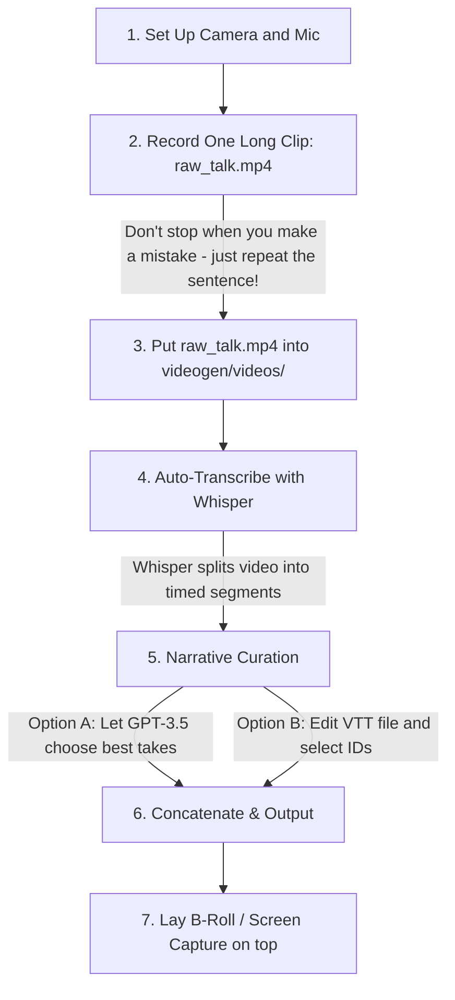

# AuraRadar YouTube Video Launch and Production Plan

This document provides a highly structured production plan and full scripting blueprint for presenting AuraRadar on YouTube. 

To help you get the most out of videogen, this plan includes a detailed section on how to structure your recordings, how to map them to videogen's processing pipelines, and a customized script template.

---

## Production Strategy and Videogen Workflow

Your videogen tool is the perfect partner for this video because it automates the tedious talking head editing. You do not need to record a single flawless take. Instead, you can speak naturally, pause to think, repeat sentences if you trip over words, and let the software handle the cuts.

### Recommended Recording Workflow

### Step 1: Record your A-Roll (Talking Head)
* **The One Take Trick**: Record a single long video (raw_talk.mp4) covering the script. If you stumble or make a mistake, do not stop recording. Simply pause for 2 seconds, look back at the camera, and say the sentence again. 
* **Maintain Energy**: Keep your eyes on the lens and let your enthusiasm for the project shine through.

### Step 2: Leverage Videogen for the First Cut
* **Whisper Processing**: Place raw_talk.mp4 in videogen/videos/. Run the script to let Whisper transcribe and generate timed segments in transcripts/raw_talk.vtt.
* **Curation**: 
  * If using **Automated Mode**: The GPT-3.5 API will read the transcript segments, identify repetitions, filler words ("um", "ah", "like"), and dead air, and output only the clearest, highest-quality takes.
  * If using **Stitching Mode**: You can open transcripts/raw_talk.vtt, see the timestamps, and write a small script (similar to your align_video.py) that lists only the specific segment IDs or timestamps of the takes you liked.
* **Output**: Run the compiler to get a perfectly edited, fast-paced talking head video track (coherent_storyline.mp4) with zero pauses or awkward transitions.

### Step 3: Layer B-Roll
* In post-production, import the compiled A-roll and overlay screen captures of the AuraRadar UI (React desktop/mobile), terminal screens (running make run), or diagrams when the script refers to them.

---

## High-Fidelity Video Script and Storyboard

* **Target Length**: ~6 - 8 Minutes
* **Tone**: Visionary, passionate, intellectually honest, and deeply technical (practitioner-to-practitioner).

### Section 1: The Hook and The Social Crisis (0:00 - 1:15)

| Time | Visual on Screen | Speaker Script / Audio |
| :--- | :--- | :--- |
| **0:00** | A-roll of you looking directly at the camera. A dark, premium aesthetic. Behind you, a subtle animation of a radar scanning or a terminal window. | "We are living in a profound paradox. We have never been more digitally connected, yet we are in the midst of a global loneliness pandemic." |
| **0:15** | Quick screen captures of standard commercial dating and social apps (Tinder, Bumble, etc.) showing swiping, followed by a graphic of a centralized server storing coordinates and chat histories. | "The commercial social and dating apps we rely on have a fundamental, structural conflict of interest: their business models are designed to keep you swiping endlessly on their platform to monetize your attention. If you actually find a real connection and get off their app, they lose a customer.   Worse, standard apps force you to surrender your absolute data sovereignty—sending your location history, preferences, and private swipes to centralized databases." |
| **0:45** | B-roll transition to a clean, gorgeous glassmorphism UI of AuraRadar running on a phone/desktop. Shows a scanning radar screen. | "I wanted to build something entirely different. A tool that returns the power of connection back to your immediate physical space, with absolute privacy.   Say hello to AuraRadar: a completely open-source, serverless, local-first proximity network designed to get you off your screen and into real-world, face-to-face conversations." |

---

### Section 2: The Core Flow Demo (1:15 - 2:45)

> [!TIP]
> Use a screen capture tool to record a live interaction between two simulated P2P nodes running on your computer. You can use your bld/convert_webp_to_mp4.py script to generate high-quality MP4 recordings of the web client.

| Time | Visual on Screen | Speaker Script / Audio |
| :--- | :--- | :--- |
| **1:15** | Screen capture of the onboarding flow. Sleek glassmorphism text fields, profile creation. | "Let's look at how this works in practice. When you launch AuraRadar, there are no central servers to log into. Your profile, your 'type', and your interactions reside entirely on your physical device, fully encrypted in a local SQLCipher database.   You set up your public 'vibe tags'—like Rust development, sci-fi novels, or indie music." |
| **1:40** | The Proximity Radar screen. An animated circular mesh waves out, scanning for nearby users. Suddenly, a nearby resonance is detected. | "Once active, the app scans your physical proximity for other peers. Using a specialized P2P mesh network, it discovers nearby active profiles. When a co-present peer enters your orbit, they appear on your radar as a 'Resonance'." |
| **2:05** | Swiping and interacting with an encounter card. Detail screen opens showing profile, bio, and proximity indicator. | "You can inspect their profile, interests, and distance. If there's a mutual resonance and you both swipe 'Like', the app triggers an immediate match celebration." |
| **2:25** | Navigating to the P2P chat screen. Sending messages in real-time. Shows the "Aura Score" changing. | "Instantly, a secure, local peer-to-peer chat thread is established. You can send an encrypted greeting to break the ice and coordinate a face-to-face meetup right then and there. Once you connect, the app gets out of your way." |

---

### Section 3: The Transit Space Nightmare and Ghost Mode (2:45 - 4:00)

| Time | Visual on Screen | Speaker Script / Audio |
| :--- | :--- | :--- |
| **2:45** | B-roll of a busy city bus or a crowded coffee shop. Pop a graphic of a comic panel from the project layout on screen. | "Now, if you've ever used a location-based app, you know there is a serious safety hazard. If you're on a crowded bus or in a tight coffee shop, turning on a proximity scanner can feel incredibly vulnerable. If anyone can see exactly where you are sitting, you risk unwanted, intrusive physical approaches.   We call this the Transit Space Nightmare." |
| **3:05** | Show the UI where "Ghost Mode" is toggled active. A sleek blue shield animation appears on the screen. | "To solve this, AuraRadar implements Ghost Mode, or Asymmetric Discovery.   When you activate Ghost Mode, your phone goes completely radio-silent. It broadcasts absolutely nothing. However, it continues to passively listen to active broadcasters in the room, creating a temporary, secure list of silhouettes stored only on your device. You are completely invisible to the room." |
| **3:30** | Diagram showing the asynchronous match flow: Sarah at home, Alex walking his dog. Sarah's swipe becomes an encrypted "digital envelope" sent via secure mail, resolved when they are separated. | "Once you return to the safety of your home, you can review your history and swipe on people you crossed paths with. Because you're no longer in physical range, the app packages your swipe into a cryptographically locked digital envelope that only the recipient's phone can decrypt.   They get the notification later, and when they swipe back, the match is completed. Spontaneous connection, absolute physical safety." |

---

### Section 4: Advanced Architecture and The Cryptography (4:00 - 6:30)

> [!IMPORTANT]
> This is where you appeal to the developer and open-source community. Highlight the mathematical elegance and the technical stack.

| Time | Visual on Screen | Speaker Script / Audio |
| :--- | :--- | :--- |
| **4:00** | Architectural diagram or high-level overview table of the tech stack: Frontend React (Vite), Native Rust (Tauri v2), SQLCipher, libp2p. | "Let's open the hood and talk about the architecture. AuraRadar is built as a hybrid native application. The user interface is a high-performance React frontend styled with custom glassmorphism.   But the real engine is written in native Rust, bridged securely to the frontend using Tauri v2." |
| **4:30** | Screen capture of Rust code. Scroll through standard P2P mesh network configuration or subnet dialing code. | "First, there are no central servers. Proximity discovery is handled entirely through an autonomous P2P swarm. Under the hood, we leverage libp2p for mesh networking.   To bypass OS-level multicast blocks and mobile hotspot restrictions, we built a dedicated subnet dialing thread running on port 14224 that directly establishes TCP handshakes between mobile nodes, even when behind complex NATs." |
| **5:00** | Visual of the Paillier Cryptosystem and Bulletproofs formulas:  $$E(d^2) = E(X_1^2 + Y_1^2) \cdot E(X_1)^{-2X_2} \cdot ...$$ | "But how do we prove two people are close to each other without exposing their raw GPS coordinates? If a malicious node queries the app repeatedly, they could triangulate your exact location.   AuraRadar solves this using Zero-Knowledge Proximity Handshakes based on continuous Euclidean distances." |
| **5:30** | A clean visual animation of the ZK handshake steps:  1. Peer A sends encrypted coordinates $E(X_1), E(Y_1)$ using Paillier public keys.  2. Peer B homomorphically computes blinded squared distance $E(d^2 \cdot r)$ using a random blinding factor $r$.  3. Peer A decrypts it, generates a Merlin range proof (Bulletproof) showing $d^2 \cdot r \le D_{max}^2 \cdot r$.  4. Peer B verifies the proof. | "Here is the math. Peer A encrypts their coordinates using the Paillier homomorphic cryptosystem and sends the ciphertexts to Peer B. Because Paillier is additively homomorphic, Peer B can compute the encrypted squared distance between them without learning Peer A's actual coordinates.   To prevent Peer A from learning the distance upon decryption, Peer B multiplies it by a high-entropy random blinding factor $r$. Peer A decrypts the blinded value, and generates a compact Bulletproof range proof proving that the blinded distance is less than the maximum allowable range.   Peer B verifies the Bulletproof. Proximity is verified, coordinates remain 100% secret, and no trusted setup is ever required." |
| **6:10** | Show AuraForegroundService.kt Kotlin code on screen, showing BLE scanning background loop. | "For mobile devices, this whole process is compiled down to highly optimized native Rust libraries exposed to a persistent Android Foreground Service. This keeps the proximity scanning active in the background, firing local notifications even when your phone is in your pocket." |

---

### Section 5: The Call to Action and Open Source Mission (6:30 - End)

| Time | Visual on Screen | Speaker Script / Audio |
| :--- | :--- | :--- |
| **6:30** | A-roll of you looking back to the camera, speaking with conviction. | "AuraRadar is more than just a software utility. It is an exploration in reclaiming our digital spaces. It is a proof-of-concept that local-first, serverless networks can replace extractive attention-economy platforms and help us build healthy, safe, face-to-face communities." |
| **6:50** | Show the GitHub page (github.com/BenSiv/auraradar) and the email link to join the Android Beta testing group. | "The entire project is completely open source under the AGPL v3 license.   We are actively seeking beta testers to join our Google Play private test group. If you want to install it on your Android device and help us test proximity mesh routing in the wild, send an email to bensiv92@gmail.com with your Google Play email address!   Check out the code on GitHub, drop a star, and let's build a decentralized, local-first web together. Thanks for watching." |
